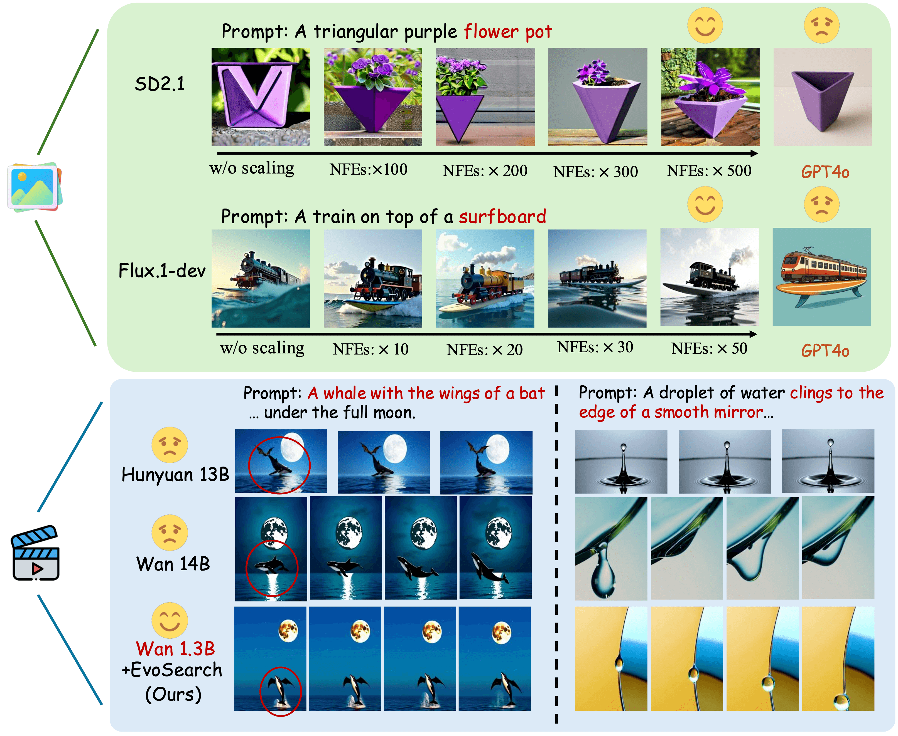

<p align="center">
  
</p>
<p align="center">
  <a href="https://tinnerhrhe.github.io/evosearch/">
    
  </a>
  <a href="https://arxiv.org/abs/2505.17618">
    
  </a>
  <a href="https://x.com/tinner_he/status/1926939246876614735">
    
  </a>
</p>

# Scaling Image and Video Generation via Test-Time Evolutionary Search
<!-- **[Haoran He](https://tinnerhrhe.github.io), [Jiajun Liang](https://scholar.google.com/citations?hl=en&user=xNxlvjEAAAAJ), [Xintao Wang](https://xinntao.github.io/), [Pengfei Wan](https://scholar.google.com/citations?user=P6MraaYAAAAJ&hl=en), [Di Zhang](https://openreview.net/profile?id=~Di_ZHANG3), [Kun Gai](https://scholar.google.com/citations?hl=en&user=PXO4ygEAAAAJ),[Ling Pan](https://ling-pan.github.io/)** -->
## 📖 Introduction
We propose **Evo**lutionary **Search** (**EvoSearch**), a novel and generalist test-time scaling framework applicable to both image and video generation tasks. EvoSearch significantly enhances sample quality through strategic computation allocation during inference, *enabling Stable Diffusion 2.1 to exceed GPT4o, and Wan 1.3B to outperform Wan 14B model and Hunyuan 13B model with 10✖️ fewer parameters*.
<div align="center">
    
</div>

## 🧠 Method
EvoSearch introduces a novel perspective that reinterprets the denoising trajectory as an evolutionary path, where both the initial noise $x_T$ and the intermediate state $x_t$ can be evolved towards higher-quality generation, actively expanding the exploration space beyond the constraints of the pre-trained model's distribution. Different from classic evolutionary algorithms that optimize a population set in a fixed space, EvoSearch considers dynamically moving forward the evolutionary population along the denoising trajectory starting from $x_T$ (i.e., Gaussian noises).
<div align="center">
    
</div>

## 🛠️ Instructions
Set up the environment
```
git clone https://github.com/tinnerhrhe/EvoSearch-codes.git
cd EvoSearch-codes
conda create -n evosearch python=3.9.0 -y
conda activate evosearch
pip install -r requirements.txt
```
You can try EvoSearch on Stable Diffusion 2.1 via the following commands.
```
cd SD2.1
python evosearch.py --guidance_reward ImageReward --evolution_schedule 0 20 30 40 --population_size_schedule 42 26 26 26 30
``` 
Guidance reward function is pre-defined for search, while evolution schedule and population size schedule can be freely chosen, considering the available test-time computation budget.

You can try EvoSearch on a more advanced T2I model Flux.1-dev via the following commands.
```
cd FLUX
python evosearch.py --guidance_reward ImageReward --evolution_schedule 5 20 30 40 --population_size_schedule 14 7 7 7 10
```

For video generation, please first download the guidance reward model and T2V model following the [instructions](./Wan/README.md). Then you can play EvoSearch via the following commands.
```
cd Wan
python evosearch.py --evolution_schedule 5 20 30 45 --population_size_schedule 10 5 5 5 5
```
## 📮 TODO

More codes will come soon! Stay tuned!
- [ ] Release the codes of EvoSearch on Hunyuan for video generation.
- [X] Release the codes of EvoSearch on FLUX.1-dev for image generation.
- [X] Release the codes of EvoSearch on Wan for video generation.
- [X] Release codes of evosearch on Stable Diffusion 2.1 for a quick example.

## 👍 Acknowledgement
We thank the following open-source works:

[Stable Diffusion](https://github.com/Stability-AI/stablediffusion)

[FLUX](https://github.com/black-forest-labs/flux) 

[Wan-Video](https://github.com/Wan-Video)

[HunyuanVideo](https://github.com/Tencent-Hunyuan/HunyuanVideo)

[FK-Diffusion-Steering](https://github.com/zacharyhorvitz/Fk-Diffusion-Steering)

[Diffusion Alignment as Sampling](https://github.com/krafton-ai/DAS)

## 📜 Citation
If you find our work helpful, please kindly cite our paper:
```
@misc{he2025scaling,
    title={Scaling Image and Video Generation via Test-Time Evolutionary Search},
    author={Haoran He and Jiajun Liang and Xintao Wang and Pengfei Wan and Di Zhang and Kun Gai and Ling Pan},
    year={2025},
    eprint={2505.17618},
    archivePrefix={arXiv},
    primaryClass={cs.CV}
}
```
## 🌟 Star History

[](https://star-history.com/#tinnerhrhe/EvoSearch-codes&Date)
